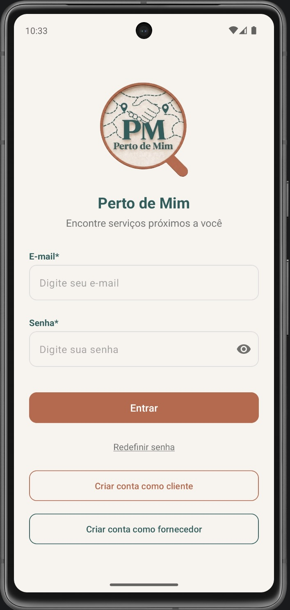
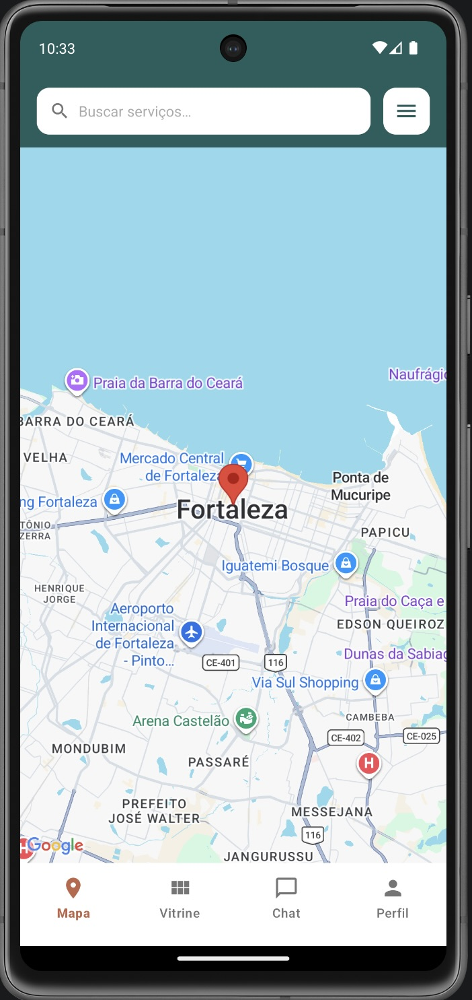
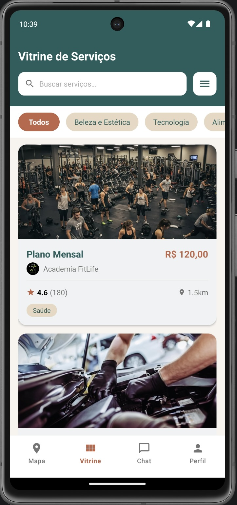
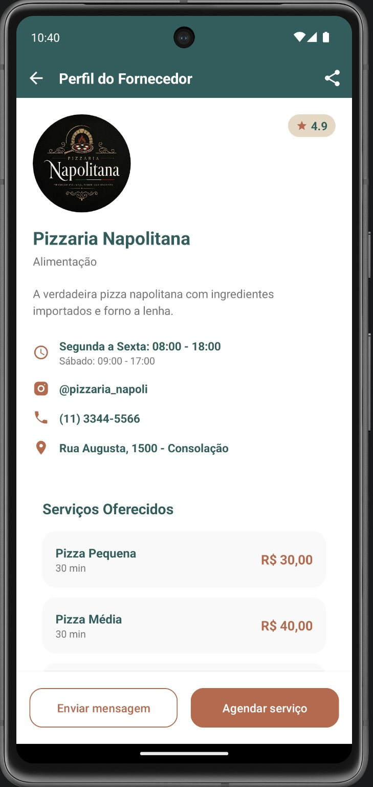
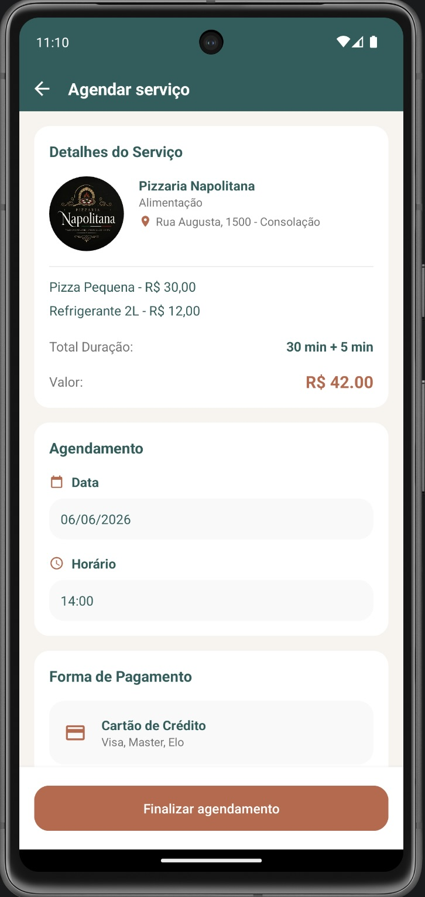
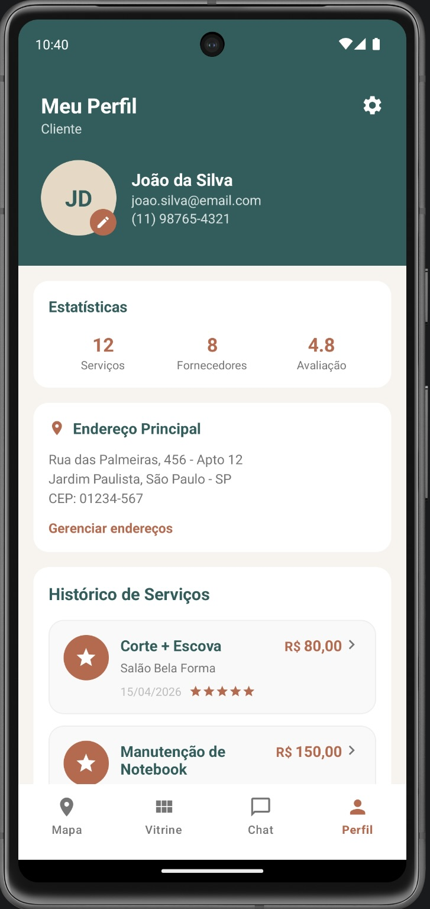

<h1 align="center">
   
  Perto de Mim
   
</h1>

  Aplicativo para encrontrar prestadores de serviço perto de você.

  
  
  
  

---

## Sobre o app

O **Perto de Mim** é um marketplace mobile que conecta clientes a prestadores de serviços locais. Em vez de pesquisar em vários lugares, o usuário abre o app, vê no mapa quem está por perto, confere avaliações, contrata e paga, sem sair da plataforma.

Do outro lado, prestadores têm um espaço próprio para divulgar seus serviços, gerenciar pedidos e se comunicar com clientes.

---

## Funcionalidades

### Para clientes

| | |
|---|---|
| **Mapa interativo** | Visualize prestadores e serviços próximos em tempo real |
| **Busca avançada** | Filtre por preço, distância, categoria e avaliação |
| **Chat integrado** | Converse com o prestador antes e durante o serviço |
| **Pagamento no app** | Pix, cartão de crédito ou débito |
| **Avaliações** | Avalie o serviço após a conclusão |
| **Favoritos** | Salve seus prestadores preferidos |

### Para prestadores

| | |
|---|---|
| **Perfil de negócio** | Apresente sua loja com descrição, categoria, preço médio e fotos |
| **Gestão de serviços** | Cadastre e gerencie os serviços oferecidos |
| **Gestão de pedidos** | Aceite, recuse ou conclua pedidos de clientes |
| **Chat com clientes** | Comunicação direta pelo app |
| 🌟 **Reputação** | Acompanhe avaliações e sua média de nota |

---

## 🗂️ Categorias

  
  
  
  
  
  
  

---

## Telas

<table align="center">
  <tr>
    <td align="center">Autenticação </td>
    <td align="center">Mapa </td>
    <td align="center">Vitrine </td>
  </tr>
  <tr>
    <td align="center">Perfil do Fornecedor </td>
    <td align="center">Tela de Pagamento </td>
    <td align="center">Perfil do Cliente </td>
  </tr>
</table>

---

## Tecnologias

### Frontend

| Tecnologia | Descrição |
|---|---|
| Java 11 | Linguagem principal do app Android |
| Android SDK 26–36 | Suporte ao Android 8.0 e versões mais recentes |
| Material Design 3 | Componentes visuais modernos (cards, sliders, inputs) |
| Google Maps SDK 19 | Mapa interativo com marcadores de prestadores |
| Retrofit 2 + Gson | Requisições HTTP e serialização JSON |
| SharedPreferences | Sessão do usuário e token JWT local |
| Gradle 9.4.1 | Build system com Version Catalogs |

### Backend

| Tecnologia | Descrição |
|---|---|
| Node.js (ES Modules) | Runtime do servidor |
| Express 5 | Framework web para a API REST |
| PostgreSQL | Banco de dados relacional |
| JWT | Autenticação com token (expira em 7 dias) |
| bcrypt | Hash seguro de senhas |
| multer | Upload de imagens (portfólio e chat) |
| Resend | Envio de e-mails transacionais |
| Railway | Hospedagem e deploy do backend |
